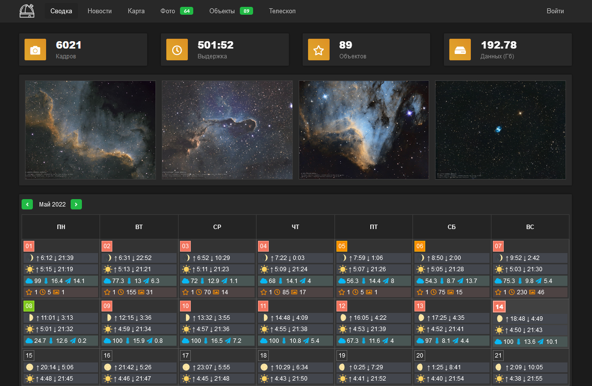
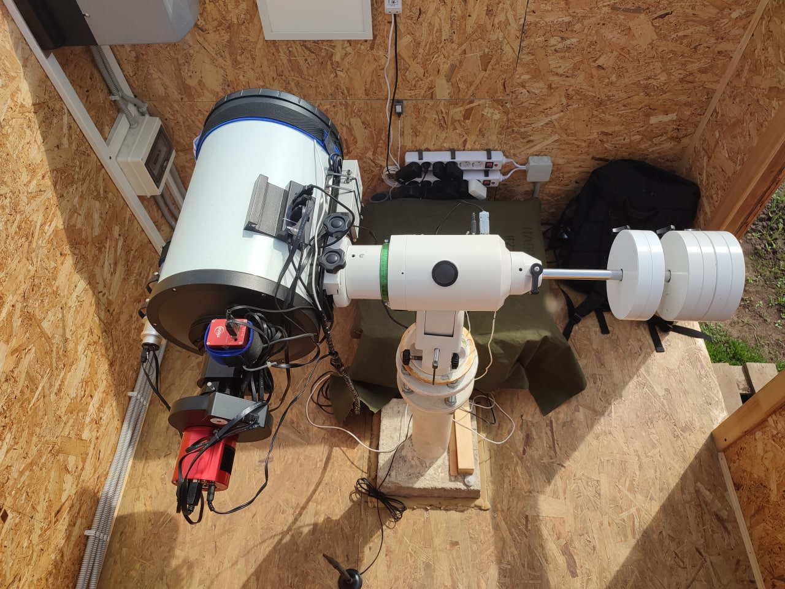

Amateur astronomical observatory portal
===============
[](https://github.com/miksrv/observatory/actions/workflows/build.yml)
[](https://github.com/miksrv/observatory/actions/workflows/deploy.yml)
[](https://sonarcloud.io/summary/new_code?id=miksrv_observatory)
[](https://sonarcloud.io/summary/new_code?id=miksrv_observatory)

### ⚠️ DEPRECATED ⚠️
See new reposiroty: [Amateur Astronomical Observatory](https://github.com/miksrv/astronomy-portal)

Portal of a self-made automatic remote astronomical observatory. The repository contains an interface for managing and monitoring the work of the observatory, displaying the received data, processed photographs. Server part - for the operation of the portal and receiving data from the observatory controller and loading FITS frames. Firmware for the Arduino controller, which allows you to manage the power supply of devices, collect information from temperature and humidity sensors and other telemetry parameters.

[ [DEMO](https://observatory.miksoft.pro/) ]



----------------------
### Observatory 

This is an amateur and completely homemade astronomical observatory project. The goal of the project is to teach the skills of building objects offline, writing drivers in C++, scripts in Python to automate the process of equipment operation. In addition, obtaining good astrophotography of deep-sky objects, observing comets, asteroids and searching for supernovae and variable stars. 



The observatory controller is based on Ardunio (AVR) and connects to the observatory network. The controller is controlled by means of HTTP requests, which send commands to switch the state of the relay and other elements of the power load. The controller's WEB client sends statistics to a remote server ([API](https://github.com/miksrv/api-backend)) at a specified time interval. The web interface in this repository displays statistics from the backend server and sends commands to the observatory controller through it. 


##### Controller components 
- Arduino Mega 2560
- INA219 I2C sensor
- Relay shield 16 channel
- DHT22
- DS18B20

### API methods
The response format is JSON, the response structure is always the same, only payload will change in different APIs

```json
{
  "status": true,
  "payload": []
}
```

<details>
    <summary>Statistic: Frames, photos, exposure and data volume</summary>

  ``/api/get/statistic/summary``
  ```json
    {
      "photos": 63,
      "objects": 89,
      "frames": 5987,
      "exposure": 1785611,
      "filesize": 196289
    }
  ```
</details>

<details>
    <summary>Statistic: List days in a month (ex: 2022-05) when the observatory worked (stat)</summary>

  ``/api/get/statistic/month?date=${string}``
  ```json
    [
      {
        "date": "2022-05-06",
        "exposure": 4500,
        "frames": 15,
        "objects": [
          "M_51"
        ]
      },
      {
        "date": "2022-05-07",
        "exposure": 13800,
        "frames": 46,
        "objects": [
          "M_51"
        ]
      }
    ]
  ```
</details>

<details>
    <summary>Catalog: List of directory objects</summary>

  ``/api/get/catalog/list``
  ```json
    [
      {
        "name": "V1405_Cas",
        "title": "Новая Кассиопеи (V1405 Cas)",
        "text": "Вспышка классической новой звезды, представляющая собой взрыв на поверхности белого карлика.",
        "category": "Сверхновые",
        "ra": 351.147,
        "dec": 61.1585
      }
    ]
  ```
</details>

<details>
    <summary>Catalog: Item directory object by name</summary>

  ``/api/get/catalog/item?object=${string}``
  ```json
    {
      "name": "V1405_Cas",
      "title": "Новая Кассиопеи (V1405 Cas)",
      "text": "Вспышка классической новой звезды, представляющая собой взрыв на поверхности белого карлика.",
      "category": "Сверхновые",
      "ra": 351.147,
      "dec": 61.1585
    }
  ```
</details>

<details>
    <summary>Photo: List of all photos (without photo params)</summary>

  ``/api/get/photo/list``
  ```json
  [
      {
        "object": "NGC_896",
        "date": "2022-02-09",
        "file": "NGC_896-710m-2022.02.09",
        "ext": "jpg",
        "author": {
          "name": "Author name",
          "link": ""
        }
      }
  ]
  ```
</details>

<details>
    <summary>Photo: list of all photos of one object (by obj name)</summary>

  ``/api/get/photo/list?object=${string}``
  ```json
  [
      {
        "object": "M_33",
        "date": "2020-12-25",
        "file": "M33-630m-2020.12.25",
        "ext": "jpg",
        "author": {
          "name": "Author name",
          "link": ""
        },
        "parameters": {
          "date": "2020-08-26 23:10:55",
          "exposure": 45367,
          "frames": 214,
          "filesizes": 7016,
          "filters": {
            "Luminance": {
              "exposure": 13203,
              "frames": 45
            },
            "Red": {
              "exposure": 11138,
              "frames": 75
            },
            "Green": {
              "exposure": 8722,
              "frames": 51
            },
            "Blue": {
              "exposure": 7500,
              "frames": 25
            },
            "Ha": {
              "exposure": 4804,
              "frames": 18
            },
            "OIII": {
              "exposure": 0,
              "frames": 0
            },
            "SII": {
              "exposure": 0,
              "frames": 0
            }
          }
        }
      }
  ]
  ```
</details>

<details>
    <summary>Object: list of all captured objects</summary>

  ``/api/get/object/list``
  ```json
    [
      {
        "name": "NGC_925",
        "date": "2021-10-10 00:51:07",
        "exposure": 51300,
        "frames": 171,
        "Luminance": 12900,
        "Red": 14700,
        "Green": 13500,
        "Blue": 10200,
        "Ha": 0,
        "OIII": 0,
        "SII": 0
      }
    ]
  ```
</details>

<details>
    <summary>Object: list of only the names of all captured objects</summary>

  ``/api/get/object/names``
  ```json
    [
      "Vesta_A807_FA",
      "V1405_Cas",
      "UGC_6930",
      "Sh2_132",
      "Sh2_109",
      "Sh2_103",
      "Sh2-168"
    ]
  ```
</details>

<details>
    <summary>Object: Get the params of the captured object (by name)</summary>

  ``/api/get/object/item?object=${string}``
  ```json
    {
      "date": "2020-08-26 23:10:55",
      "exposure": 45367,
      "frames": 214,
      "filesizes": 7016,
      "filters": {
        "Luminance": {
          "exposure": 13203,
          "frames": 45
        },
        "Red": {
          "exposure": 11138,
          "frames": 75
        },
        "Green": {
          "exposure": 8722,
          "frames": 51
        },
        "Blue": {
          "exposure": 7500,
          "frames": 25
        },
        "Ha": {
          "exposure": 4804,
          "frames": 18
        },
        "OIII": {
          "exposure": 0,
          "frames": 0
        },
        "SII": {
          "exposure": 0,
          "frames": 0
        }
      }
    }
  ```
</details>

<details>
  <summary>File: List of all object files (by name)</summary>

  ``/api/get/file/list?object=${string}``
  ```json
    [
      {
        "id": "fe03bc1c2cfd97de1f97edbdd57e3acb",
        "name": "M33_Light_Red_300_secs_2020-08-27T03-45-00_010.fits",
        "date": "2020-08-26 22:39:59",
        "filter": "Red",
        "exposure": 300,
        "temp": -10,
        "offset": 10,
        "gain": 120,
        "dec": 30.5457,
        "ra": 23.4641
      }
    ]
  ```
</details>

----------------------
### Project structure

This project consists of 3 main sections: 

1. [ **firmware** ] Firmware for Arduino microcontroller (AVR), observatory controller control unit.
2. [ **backend** ] Backend server. 
3. [ **frontend** ] Observatory control interface. Written in ReactJS + Redux (use Node and NPM). To debug an application on a local server, you must first install the required dependencies:
  * `npm install` Installing dependencies.
  * `npm update` Update all dependencies.
  * `npm start` Launches a local webserver for debugging the application.
  * `npm run build` Compiles applications for deployment.

### How to start
The portal requires hosting with PHP and MySQL support.
1. In the root directory on the hosting, create a folder `api`. Upload files to it from the `backend` repository directory.
2. Install dependencies for PHP (**CodeIgniter v4** framework), to do this, run the command in the `api` root directory (where the backend was loaded and where the `composer.json` file is located):
```bash
php composer.phar install
```
If the hosting does not support composer, then this can be done on the local computer, and after installation, upload all files to the server, to the `api` directory.
3. Create a database, upload the MySQL dump there from the `MySQL_dump_DD.MM.YYY.sql` file, which is in the root of the backend repository. Don't forget to delete the dump from the hosting!
4. In the hosting `api` root directory, rename the `env` file to `.env`. Then edit it and configure the database connection and other parameters:

Observatory location data (for calculating the Moon and Sun):
```
app.appTimezone = Asia/Yekaterinburg
app.timezone  = 5
app.latitude  = 51.7727
app.longitude = 55.0988
```
The URL of the Arduino controller (relay control) and a link to a static image from the observatory's camera (the section will be described later).
```
app.observatory.controller = http://observatory.local/
app.observatory.webcam_1 = http://observatory.local:8010/webcamphoto/image.jpg
app.observatory.webcam_2 = http://observatory.local:8020/webcamphoto/image.jpg
```
For the news section, integration with the social network VK is used. For it to work, you need to generate an application key, a token.
```
app.vkapi.token   =
app.vkapi.domain  =
app.vkapi.version = 5.145
```
Login and password for authorization on the portal (keep it secret) and session lifetime in seconds:
```
app.user_username = login
app.user_password = password
app.user_session_time = 120
```
Set up a MySQL database connection:
```
database.default.hostname = localhost
database.default.database = your_DB
database.default.username = your_USER
database.default.password = your_PASSWORD
database.default.DBDriver = MySQLi
```
5. Installation and configuration of the Portal API is now complete. Now you need to configure and install the interface. On your local computer, in the frontend directory of the repository, rename the `env` file to `.env`. Edit it:
```
REACT_APP_API_HOST = 'https://observatory.miksoft.pro/api/'
REACT_APP_METRIKA  = ''
```
The `REACT_APP_API_HOST` parameter is responsible for determining the URL to the backend server API. If, following the instructions above, you placed the source code in the `api` directory on the server, then the value of this parameter will be: `https://your_domain.com/api/`. For example, you can use my API to test your portal.

The second `REACT_APP_METRIKA` parameter is the code of any analytics service Yandex.Metrika, Google Analytics, etc...
6. Now we need to copy the interface. To do this, you must have **nodeJS** installed. In the `frontend` directory run the following commands (after exiting the previous one)
```bash
npm install
npm build
```
7. After the last command completes, a ready-made portal will be created in the `frontend/build directory`. All files can be packed and uploaded to the root directory (the `api` directory should already be there) of your site. Happy use :)
