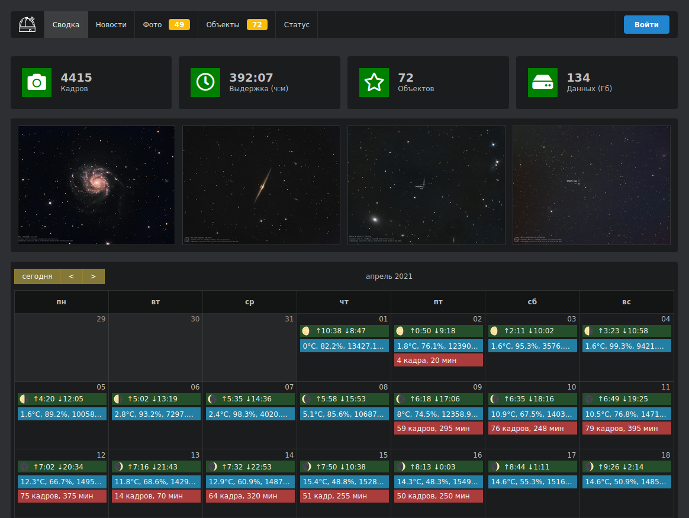
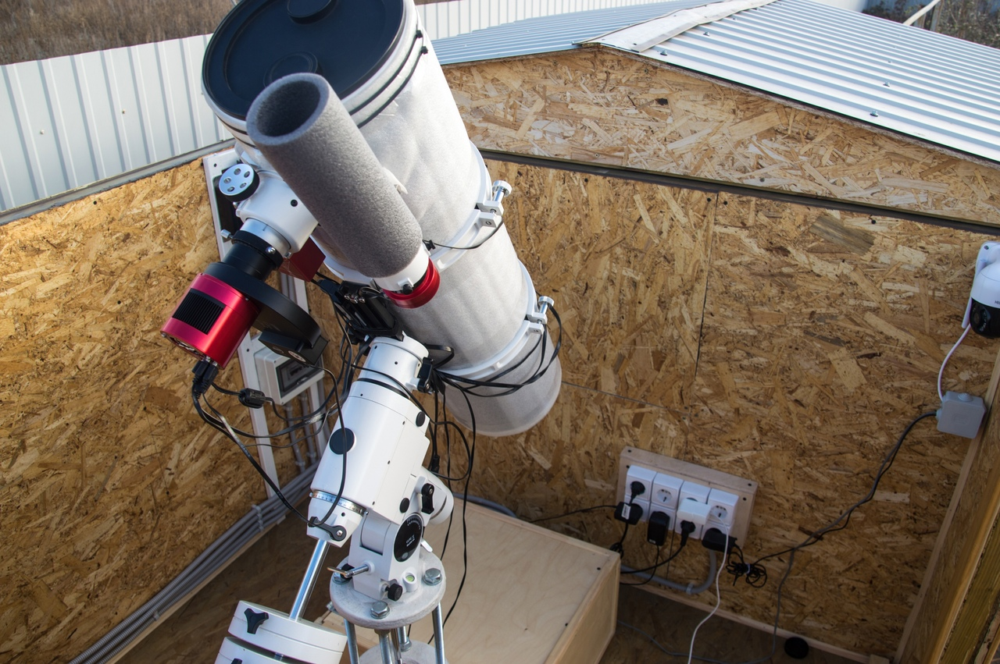
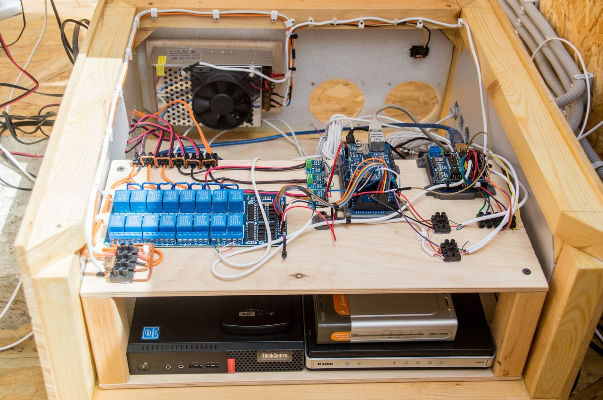

Observatory control panel
===============
An interface project for the management of an amateur astronomical observatory. The WEB-interface provides the ability to control the power supply of devices through a relay system, to receive data on temperatures at various points, humidity and voltage of various devices. The interface displays images from cameras, builds graphs for viewing archive statistics. The main function is to display statistics of the observatory's work: a calendar of filming with statistics of a filming night, display of captured objects with the number of frames in various filters, a photo gallery of the final results. 

[ [DEMO](https://observatory.miksoft.pro/) ]

----------------------
### Observatory 

This is an amateur and completely homemade astronomical observatory project. The goal of the project is to teach the skills of building objects offline, writing drivers in C++, scripts in Python to automate the process of equipment operation. In addition, obtaining good astrophotography of deep-sky objects, observing comets, asteroids and searching for supernovae and variable stars. 

The observatory controller is based on Ardunio (AVR) and connects to the observatory network. The controller is controlled by means of HTTP requests, which send commands to switch the state of the relay and other elements of the power load. The controller's WEB client sends statistics to a remote server ([API](https://github.com/miksrv/api-backend)) at a specified time interval. The web interface in this repository displays statistics from the backend server and sends commands to the observatory controller through it. 

##### Controller components 
- Arduino Mega 2560
- INA219 I2C sensor
- Relay shield 16 channel
- DHT22
- DS18B20

----------------------
### Project structure

This project consists of 3 main sections: 

1. [ **firmware** ] Firmware for Arduino microcontroller (AVR), observatory controller control unit.
2. [ **backend** ] Backend server (repository [here](https://github.com/miksrv/api-backend)). 
3. [ **frontend** ] Observatory control interface. Written in ReactJS + Redux (use Node and NPM). To debug an application on a local server, you must first install the required dependencies:
  * `npm install` Installing dependencies.
  * `npm update` Update all dependencies.
  * `npm start` Launches a local webserver for debugging the application.
  * `npm run build` Compiles applications for deployment.
